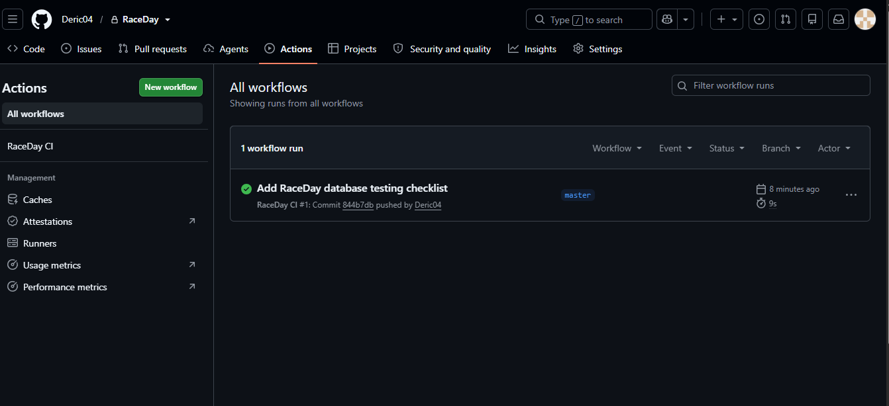

# RaceDay

## System Description

RaceDay is a race event management system designed to help organisers
create and manage running events while allowing participants to view
available races and enrol in race categories.

The system will use a Microsoft SQL Server relational database and a
RESTful API to manage race events, participants, categories and
enrolments.

## User Roles

### Organiser

An Organiser is responsible for managing race events.

Organisers can:

- Create race events
- Update race events
- Cancel race events
- Create and manage race categories
- Add categories to events
- View participants enrolled in their events

### Participant

A Participant is a user who enters races through the RaceDay system.

Participants can:

- Register an account
- Log in
- View available events
- View event details
- View race categories
- Enrol in a race
- View their enrolments
- Cancel their enrolment

## Database

The RaceDay database will contain the following seven entities:

- Organisers
- Participants
- Venues
- Events
- Categories
- EventCategories
- Enrolments

The database design includes:

- Primary keys
- Foreign keys
- Unique constraints
- Check constraints
- One-to-many relationships
- A many-to-many relationship between Events and Categories
- Sample data for testing

The `EventCategories` table resolves the many-to-many relationship
between Events and Categories, while the `Enrolments` table records
which participants have entered specific event categories.

The complete database design is documented in
[ERD.md](docs/ERD.md), and the complete SQL implementation is in
[RaceDay.sql](docs/RaceDay.sql).

## Project Validation

The SQL script includes verification queries that can be executed in
SQL Server Management Studio 2022 to confirm that:

- All database tables are created successfully
- Sample records are inserted successfully
- Event and organiser relationships work correctly
- Event and venue relationships work correctly
- Participant enrolments are correctly connected to events and categories

The database will be tested in SQL Server Management Studio before
final submission.## Project Validation

The SQL script includes verification queries that can be executed in
SQL Server Management Studio 2022 to confirm that:

- All database tables are created successfully
- Sample records are inserted successfully
- Event and organiser relationships work correctly
- Event and venue relationships work correctly
- Participant enrolments are correctly connected to events and categories

The database will be tested in SQL Server Management Studio before
final submission.

## CI/CD

GitHub Actions will be used to automatically validate the RaceDay
project whenever changes are pushed to the repository.

### Successful CI/CD Build

The RaceDay GitHub Actions workflow successfully validates the project
structure, documentation and SQL script.

## Video

An unlisted YouTube video explaining the RaceDay system, ERD,
API Endpoint Plan, SQL script, database execution and GitHub
Actions CI/CD will be added here.

**YouTube Video:** To be added after completion.